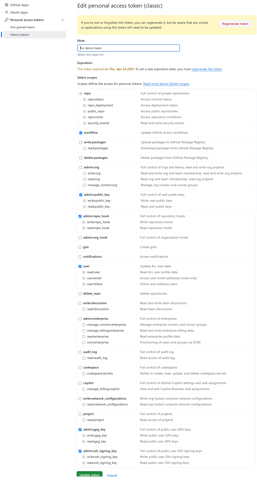
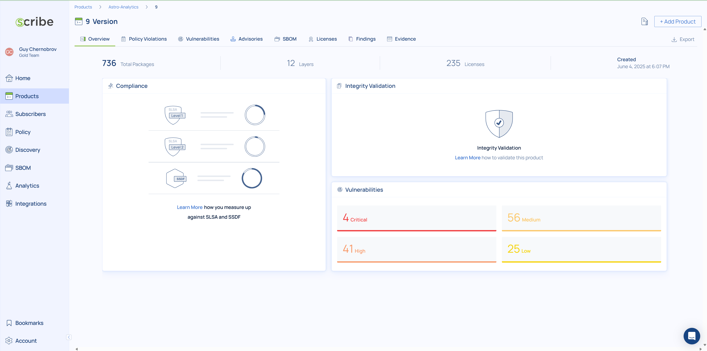
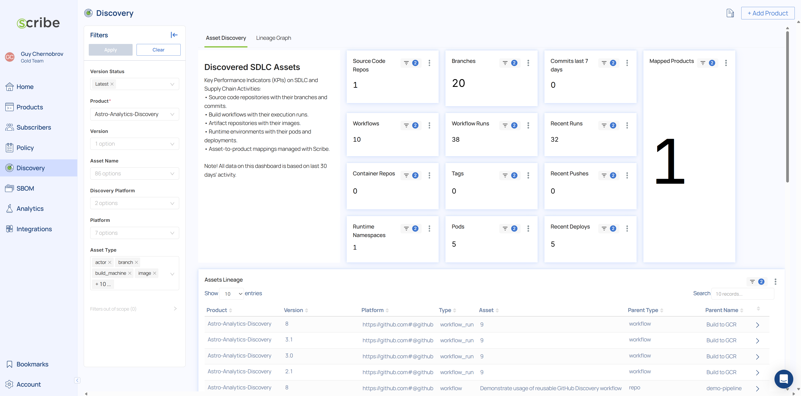

## DemoPipeline-v1.0
June 4, 2025
## Using the Scribe Demo Pipeline
## 1. Purpose
The Scribe Demo Pipeline is a sample build pipeline implemented as a GitHub Workflow. It provides a self-contained demonstration environment to help new users quickly understand the capabilities of the Scribe platform and experiment with its features.
This document offers a step-by-step guide for running the demo pipeline and introduces some of the platform’s core capabilities.
## 2. Prerequisites
To use this demo, the following prerequisites are required:
1. A GitHub account (Team plan or higher) with permissions to generate GitHub tokens and organization-level read access.
2. A Scribe Hub account with an admin user.
## 3. The Demo Use Case
Consider the following scenario: your organization has a small software project—a simple Node.js web application with some logic implemented in Python. All source files are stored in a single GitHub repository, and the application is containerized.

The repository contains a CI pipeline (implemented as a GitHub Workflow) that builds the application from the source code and packages it as a Docker container image. The same pipeline pushes the image to GitHub’s container registry (ghcr.io).

A second pipeline deploys the images from the registry to a production Kubernetes (K8s) cluster.

As a DevSecOps team member, you want to maintain strict control over supply chain risks in your CI/CD operations. Practical measures to manage these risks include:
1. Generating detailed, cryptographically verifiable SBOMs and identifying risky dependencies.
2. Creating provenance records of build products and signing them for later verification.
3. Scanning for exposed secrets in the source code.
4. Gaining visibility into the lineage of workloads in production—where they were built, their source, and ownership.
## 4. Using the Demo: Step-by-Step
1. Fork the demo repository into your own GitHub organization.
2. Generate a GitHub personal access token with the following permissions:

3. Store the token in a repository Action secret named DEMO_GH_SECRET
   (Settings → Secrets and variables → Actions → New repository secret)
4. Log into your Scribe Hub account and generate a new API token
   (Account → API Token → Create API Token)

5. Store the Scribe API token in an Action secret named SCRIBE_TOKEN
   (Settings → Secrets and variables → Actions → New repository secret)
6. You are now ready to run the build pipeline.
   Navigate to the Actions tab in your GitHub repository and run the workflow titled Build to GCR. This workflow will:
   - Build a container from the source code
   - Push the image to the GitHub container registry
   - Use Scribe’s GitHub Action action-bom to scan the built image and generate an SBOM

   The SBOM will be uploaded to your Scribe Hub account and stored under a product named Astro Analytics, with a version derived from the GitHub run ID. Viewing the product in Scribe Hub will show results similar to the screenshot below:
   

   > This method demonstrates basic SBOM generation from a build pipeline and vulnerability analysis. It requires instrumentation with action-bom.
   > To scan without instrumentation, the next step demonstrates agentless discovery.

7. Deploy a workload to a production K8s cluster and map its lineage.
   The workflow titled Discover (agentless) Pipeline combines two stages:
   - It deploys the image built in step 6 to a Kubernetes cluster (emulated using Minikube).
   - It then runs a discovery sequence across your CI/CD systems—GitHub repo, container registry, and K8s cluster—to generate attestations about all discovered assets.

   Third-party scanners are also integrated:
   - Trivy (secret scanning)
   - Opengrep (SAST)
   - Kubescape (K8s misconfigurations)

   All findings and attestations are uploaded to Scribe Hub under a product called Astro-Analytics-Discovery.
   - Results can be viewed in the Findings tab
   - Discovered assets are shown under the Discovery tab
   
   

8. Try scanning your own repositories.
   After experimenting with the demo environment, use the scan-repos workflow to analyze your own GitHub repositories. This workflow:
   - Scans your GitHub organization
   - Identifies the most recently active repositories (based on commits)
   - Scans the top n repositories (default: 5)
   - Uploads their SBOMs to Scribe Hub

   SBOMs will be stored under automatically generated product names based on the repository names.
